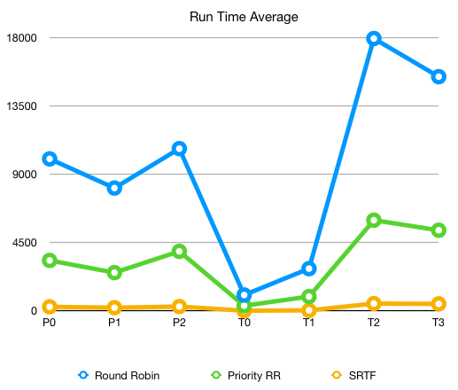
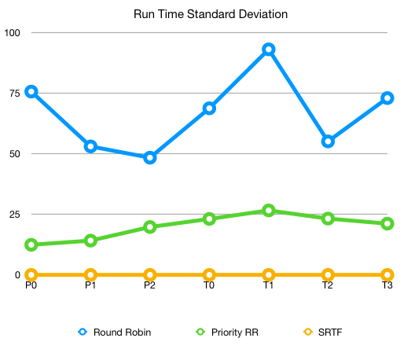

## What does this program do
A simulator simulates different scheduling algorithms. The simulation will print out statistics used to evaluate the scheduling polices.

### 3 Different Scheduling Policies
1. Pure round-robin. A first-come-first-serve queue. This scheduler does not use priority.
2. Shortest time to completion first. This scheduler does not use priority.
3. Priority round-robin. A multi-level queue, where priority 1 tasks run first, in a round-robin fashion, Then priority 2 tasks run round-robin, etc.

### The Processes
The processes that will be loaded into the simulation have multiple attributes:
1. A name
2. A type 
3. Priority
4. Amount of time to completion
5. The odds of this process yielding the process due to going to an I/O operation, as a percentage out of 100

### Loading Processes
1. Processes are loaded from the configuration file `processes.txt`, and are put in the scheduler is ready queue at the start of the simulation
2. The configuration file has a space-delimited format:
            
        thread_name thread_type priority thread_length odds_of_IO

3. 4 types of threads:
   1. id 0 - short threads
   2. id 1 - medium threads
   3. id 2 - long threads
   4. id 3 - io threads

4. 3 level of priorities: 
   1. 0 - highest priority
   2. 1 - meidum priority
   3. 2 - lowest priority

### Output
1. Average time from start to completion for each priority
2. Average time from start to completion for each type

## How to compile and run

1. Compile: `make build` generates an executable file scheduling_simulator from the C++ file scheduling_simulator.cpp
2. Run: no need to specify the processes source file, using the default `processes.txt`. `./scheduling_simulator 1` runs the pure round robin, `./scheduling_simulator 2` runs the shorteset time to completion first, and `./scheduling_simulator 3` runs the priority round robin.
3. `make clean` to remove all the generated files.

## Report

### Output of running each scheduling algorithm 10 times

`Pure Round Robin`

|    | 1     | 2     | 3     | 4     | 5     | 6     | 7     | 8     | 9     | 10    | Ave     | S. Dev. |
|----|-------|-------|-------|-------|-------|-------|-------|-------|-------|-------|---------|------------------|
| P0 | 10151 | 10054 | 9954  | 10036 | 10050 | 9906  | 9897  | 10005 | 9987  | 9986  | 10002.6 | 75.569247125475  |
| P1 | 8137  | 8100  | 8081  | 8118  | 8086  | 7987  | 8134  | 8020  | 8029  | 8129  | 8082.1  | 52.9705368839865 |
| P2 | 10656 | 10611 | 10678 | 10683 | 10717 | 10605 | 10638 | 10725 | 10747 | 10703 | 10676.3 | 48.3208029734606 |
| T0 | 1155  | 1112  | 1086  | 1063  | 958   | 1001  | 939   | 1066  | 993   | 1052  | 1042.5  | 68.6913386097549 |
| T1 | 2878  | 2735  | 2776  | 2797  | 2916  | 2624  | 2752  | 2672  | 2882  | 2766  | 2779.8  | 92.9836305784817 |
| T2 | 17861 | 17891 | 17909 | 18003 | 17924 | 17915 | 17946 | 17963 | 17832 | 17996 | 17924   | 55.0333232384404 |
| T3 | 15526 | 15443 | 15328 | 15393 | 15467 | 15264 | 15405 | 15434 | 15442 | 15422 | 15412.4 | 72.9035893034995 |

`Shortest Time To Completion First`

|    |  1  | 2   | 3   | 4   | 5   | 6   | 7   | 8   | 9   | 10  | Ave     | S. Dev. |
|----|-----|-----|-----|-----|-----|-----|-----|-----|-----|-----|---------|---|
| P0 | 267 | 267 | 267 | 267 | 267 | 267 | 267 | 267 | 267 | 267 | 267     | 0 |
| P1 | 208 | 208 | 208 | 208 | 208 | 208 | 208 | 208 | 208 | 208 | 208     | 0 |
| P2 | 284 | 284 | 284 | 284 | 284 | 284 | 284 | 284 | 284 | 284 | 284     | 0 |
| T0 | 11  | 11  | 11  | 11  | 11  | 11  | 11  | 11  | 11  | 11  | 11      | 0 |
| T1 | 33  | 33  | 33  | 33  | 33  | 33  | 33  | 33  | 33  | 33  | 33      | 0 |
| T2 | 478 | 478 | 478 | 478 | 478 | 478 | 478 | 478 | 478 | 478 | 478     | 0 |
| T3 | 459 | 459 | 459 | 459 | 459 | 459 | 459 | 459 | 459 | 459 | 459     | 0 |

`Priority Round Robin`

|    | 1     | 2     | 3     | 4     | 5     | 6     | 7     | 8     | 9     | 10    | Ave     | S. Dev. |
|----|-------|-------|-------|-------|-------|-------|-------|-------|-------|-------|---------|------------------|
| P0 | 3327 | 3315 | 3331 | 3339 | 3308 | 3308 | 3319 | 3323 | 3299 | 3308 | 3317.7 | 12.4101213173406 |
| P1 | 2523 | 2515 | 2512 | 2542 | 2499 | 2520 | 2529 | 2507 | 2494 | 2520 | 2516.1 | 14.1299524258065 |
| P2 | 3914 | 3920 | 3891 | 3948 | 3936 | 3927 | 3887 | 3895 | 3917 | 3922 | 3915.7 | 19.7430719212814 |
| T0 | 344  | 371  | 323  | 368  | 315  | 336  | 335  | 307  | 322  | 366  | 338.7  | 23.0653660519644 |
| T1 | 931  | 927  | 952  | 983  | 929  | 980  | 948  | 904  | 908  | 937  | 939.9  | 26.5767233161318 |
| T2 | 5989 | 5968 | 5962 | 5976 | 5968 | 5941 | 5979 | 6010 | 5932 | 5948 | 5967.3 | 23.2046451288434 |
| T3 | 5305 | 5286 | 5292 | 5330 | 5324 | 5300 | 5270 | 5292 | 5338 | 5304 | 5304.1 | 21.1263395367542 |

### Observation based on output

    From the average run time chart, overal we can see that the run time for each type increases if the thread gets larger and takes longer to finish. But the io threads are faster than the longest threads. For each priority, the lowest takes the longest time and then the highest priority, the fastest is the medium priority. Each scheduling algorithm follows the same trend. 
    
    Comparing the overall average runtime based on the different schedulig algorithm, we can see that STCF has the shortest average runtime for each type/priority. And the priority round-robin has the second shortest average runtime, but the pure round-robin has the longest average runtime. This means the STCF scheduling algorithm has the best performance and is the fastest algorithm among these three.

    From the standard deviation chart, overal we can see that the round-robin algorithm has obvious deviation on the output generated each time it ran. But the priority algorithm has flat deviation each time and stablizes for each type/priority, and since STCF runs one process until completion then eveytime we have the same result, no deviation which means the STCF scheduling algorithm not only has the best performance but also remains stable all the time.

### Explanation of the output

    The average runtime we calculated is time it completes minus time it starts, which is the turnaround time (but replacing arrival time with first run time). And as we learned from the text book, STCF is one of the best policies having the great turnaround time. Since it runs a job from beginning to the end, there is no waiting time at all. STCF works best if all the processes arrive at the same time, then the scheduler can first sorts the whole queue and then starts to run the process whose order is guaranteed to be the optimal order based on the time to completion.

    Round-robin contains a queue where there is no order at all. It simply runs a process for a predefined time slice and runs next one regardless of its type and priority. As we know, round-robin is one of the polices having the worst turnaround time. It works best for processes without any priority to remain fairness. 

    Priority round-robin finishes highest priority first and then runs next priority level. It contains a list of queues, where each queue holds a whole priority, and runs in the round-bin behaviour. The reason why it can achive shorter average runtime is that it makes sure that when we start a process of certain priority, the whole queue is guaranteed to complete before we run next priority level. By adding priority to round-robin, we have less average waiting and turnaround time since we only have to wait for this priority to finish instead of whole large queue. Theorectically, priority round-robin works best for real-world examples where we always have processes of various sizes, types and priorites.
